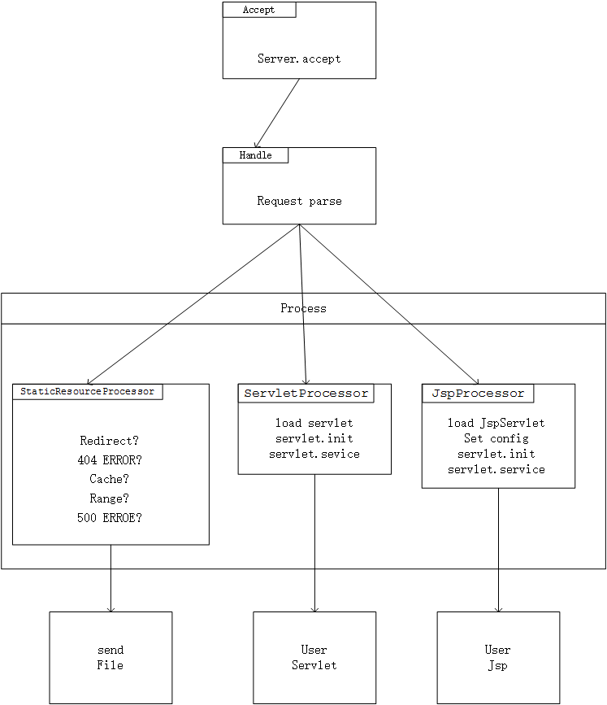
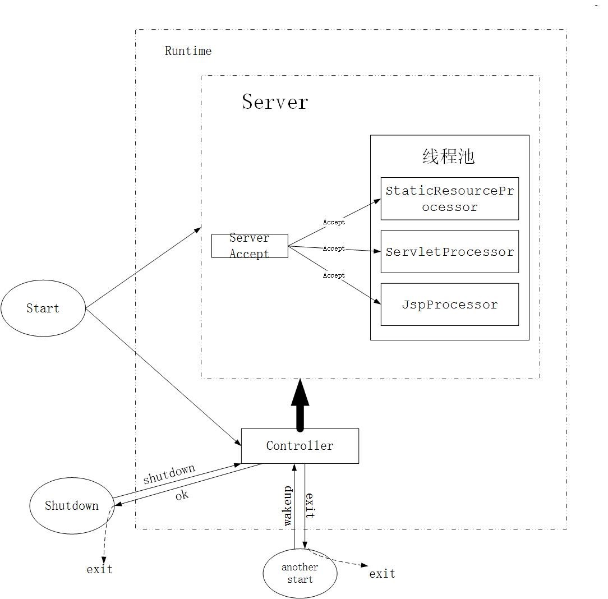
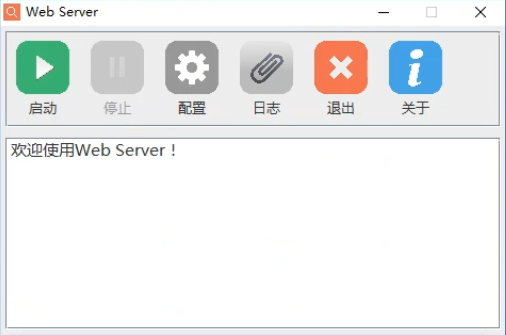
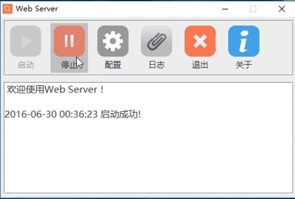
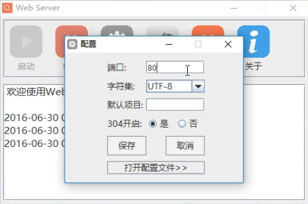
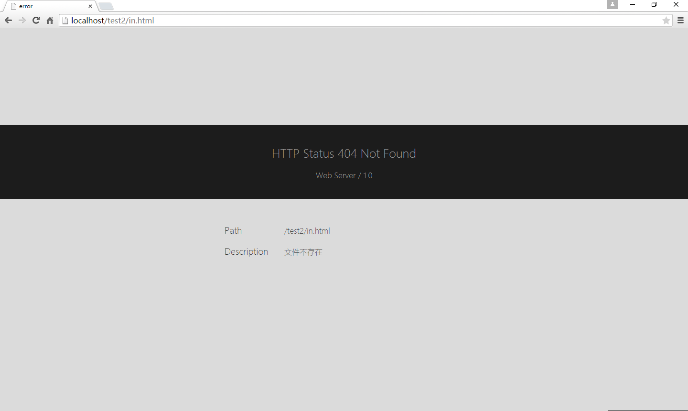
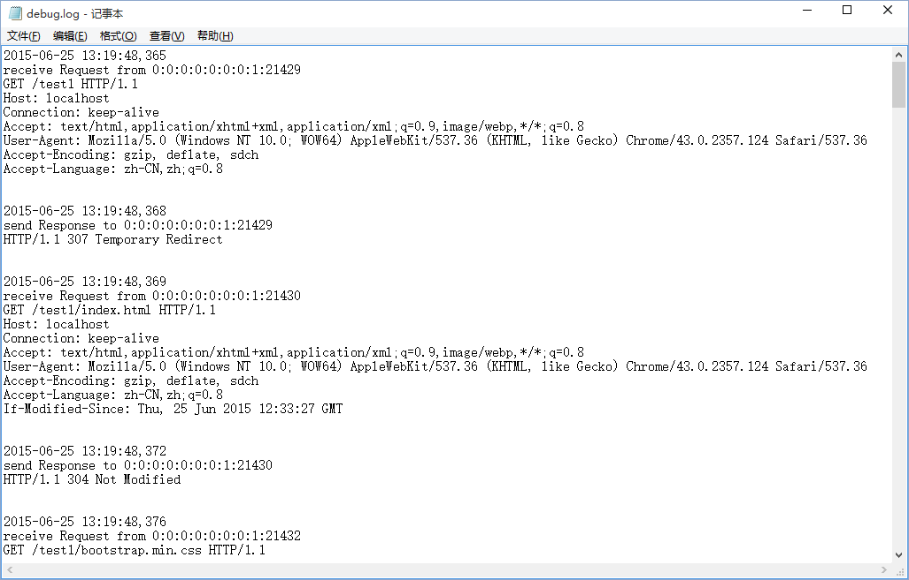

# Web Server

## 开发环境

- 语言：Java SE 1.7
- 开发工具：Eclipse
- 运行系统：装有JAVA运行环境（JRE）的Windows/Linux系统

## 目录结构

- src：项目源文件

- conf：项目配置文件。包括日志配置、系统配置、用户配置和其他配置

- doc：项目生成的文档。项目具有丰富的注释，由此生成的文档存放在此文件夹内

- img：项目用到的图片

- lib：项目依赖的包

- logs：项目输出的日志

- web：为默认的项目根目录

##  源码结构

- exception：自定义异常类
- exit：专为关闭程序而设
- GUI：图形界面
- processor：请求处理类
  - Processor 处理类接口
  - StaticResourceProcess 静态资源处理类
  - JspProcess Jsp处理类
- server：服务器内核
  - Main 主要用于开启服务器
  - Accept 接收线程类，用于等待接收请求
  - Handle 主处理类，解析请求分发处理器
  - Controller 控制线程类，用于监听控制端口，等待接收命令请求
  - Constants 常量配置类，用于读写配置文件维护常量
##  请求处理流程

服务器监听指定端口，接收请求，其中接收到的请求分为三类，分别是静态资源类请求、Servlet类请求和Jsp类请求。当服务器接收到相应的请求是，分别转发给不同的Processor类处理并返回结果。

## 线程结构

共五个线程，功能与上图中的矩形对应，线程池中存放着三种不同请求处理的线程，Controller为总控制线程，处理和分发不同的请求。发送start（启动命令字），服务器启动。服务器启动状态下，再发送start命令，则唤醒图形界面，不作其他处理。发送shutdown（停止服务器命令字），服务器停止工作，返回ok（停止服务器成功命令字）。

## 相关截图

- 打开带图形界面的服务器

- 启动服务器

- 配置服务器

- 测试页面1（HTML（图片）、CSS（图片）、JavaScript）

- 测试页面2（HTML（图片、音频、视频、Flash）、CSS）

- 404

- 日志

## 引用

- 日志记录器使用log4j-1.2.17.jar by Apache
- Xml解析器使用dom4j-1.6.1.jar by Apache
- GUI界面所有图标均是从http://www.easyicon.net/下载后进行一定的处理后得到的。

## 作者

[陈道进](https://github.com/chendaojin)，[宋孝成](https://github.com/songxiaocheng)，文诗涵